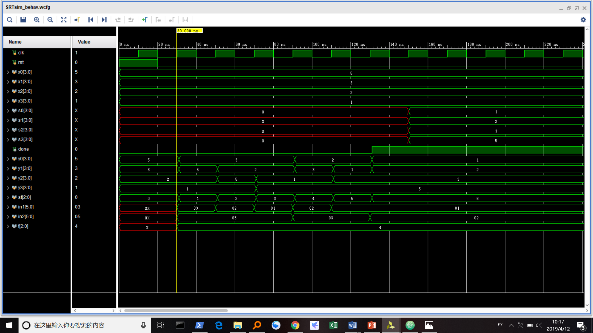
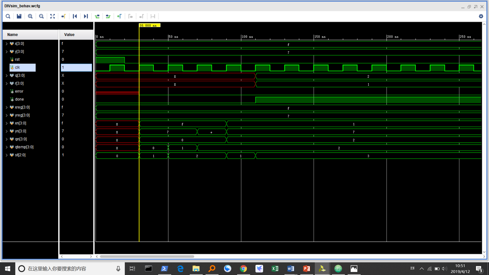

# 实验目的

- 重新巩固Verilog语法  
- 巩固数据通路和状态机的概念
- 学习如何用Verilog实现模块中的数据通路和状态机，并实现一个排序模块和除法模块。  


# 实验内容  
1.	排序：s0 ~ s3是x0 ~ x3的排序结果
2.	除法运算：x / y = q … r
   （以上均考虑无符号数）

   

# 逻辑设计  
- 模块化设计，SRT 排序一个模块，DIV 为一个除法模块。  
- 排序采用冒泡排序，有限状态机一共有 reset ，done 和6种中间状态，每个中间状态会比较两个寄存器的值，并决定是否交换。
- 除法 DIV 的逻辑为不断移位除数。有限状态机如下：

| 状态| 功能              |
|----|-------------|
| 000| 初始化                  |
| 001| 判断被除数还是不是大于除数|
| 010| 移位除数                |
| 011| done                   |
| 100| reset                  |

# 实验结果  
## SRT

1235 排序为 5321，时间花费为6个周期。下载也完全正确。

## DIV

15除以7得2余1,5个周期，下载也完全正确。

# 实验结果
实验结果符合预期，锻炼了自己的代码水平。

# 附录源码

<center>SRT.v</center>

```Verilog
module SRT(
    input [3:0] x0,
    input [3:0] x1,
    input [3:0] x2,
    input [3:0] x3,
    input rst,
    input clk,
    output reg [3:0] s0,
    output reg [3:0] s1,
    output reg [3:0] s2,
    output reg [3:0] s3,
    output done
    );
    reg [3:0] y0,y1,y2,y3;
    reg [2:0] st;
    reg [5:0] in1,in2;
    wire [2:0] s,f;
    wire [5:0] out;
    assign s=3'b001;
    assign done=st[2]&st[1]&~st[0];
    ALU alu(in1,in2,s,out,f);
    always @ (posedge clk or posedge rst)
    begin
    if(rst)
    begin
    y0<=x0;y1<=x1;y2<=x2;y3<=x3;
    st<=3'b000;
    end
    else
    begin
    case(st)
        3'b000:begin in1={2'b00,y1};in2<={2'b00,y0};#1;if(f[2]) begin y0<=y1;y1<=y0; end end
        3'b001:begin in1={2'b00,y2};in2={2'b00,y1};#1;if(f[2]) begin y1<=y2;y2<=y1; end end
        3'b010:begin in1={2'b00,y3};in2={2'b00,y2};#1;if(f[2]) begin y2<=y3;y3<=y2; end end
        3'b011:begin in1={2'b00,y1};in2={2'b00,y0};#1;if(f[2]) begin y0<=y1;y1<=y0; end end
        3'b100:begin in1={2'b00,y2};in2={2'b00,y1};#1;if(f[2]) begin y1<=y2;y2<=y1; end end
        3'b101:begin in1={2'b00,y1};in2={2'b00,y0};#1;if(f[2]) begin y0<=y1;y1<=y0; end end
        3'b110: begin s0<=y0;s1<=y1;s2<=y2;s3<=y3;end
        default:st=3'b111;
    endcase
    if(st[2:1]!=2'b11)
    st=st+3'b001;
    end
    end
endmodule
```

<center>DIV.v</center>

```Verilog
module DIV(
    input [3:0] x,
    input [3:0] y,
    input rst,
    input clk,
    output reg [3:0] q,
    output reg [3:0] r,
    output reg error,
    output done
    );
    reg [3:0] xreg,yreg,xn,yn,yn2,qn,qtemp;
    reg [2:0] st;
    assign done=~st[2]&st[1]&st[0];
    always @ (posedge clk or posedge rst)
    begin
    if(rst)
        begin
        xreg<=x;yreg<=y;
        st<=3'b000;
        end
    else
        begin
        case(st)

        3'b000:
        begin
        if(~|yreg)
        begin
        st<=3'b011;
        error<=1'b1;
        end
        else
        begin
        yn<=yreg;
        xn<=xreg;
        qn<=0;
        qtemp<=0;
        error<=1'b0;
        st<=3'b001;
        end
        end

        3'b001:
        begin
        if(xn<yn)
        begin
        q<=qn;
        r<=xn;
        st<=3'b011;
        end

        else if(xn==yn)
        begin
        q<=qn+1;
        r<=0;
        st<=3'b011;
        end

        else
        begin
        qtemp<=1;
        st<=3'b010;
        end
        end

        3'b010:
        begin
        if(yn>7|yn+yn>xn)
        begin
        xn=xn-yn;
        qn=qn+qtemp;
        yn=yreg;
        st=3'b001;
        end
        else
        begin
        yn=yn+yn;
        qtemp=qtemp<<1;
        end
        end

        3'b011:begin end
        default:st=3'b100;
        endcase
        end
        end
endmodule
```
