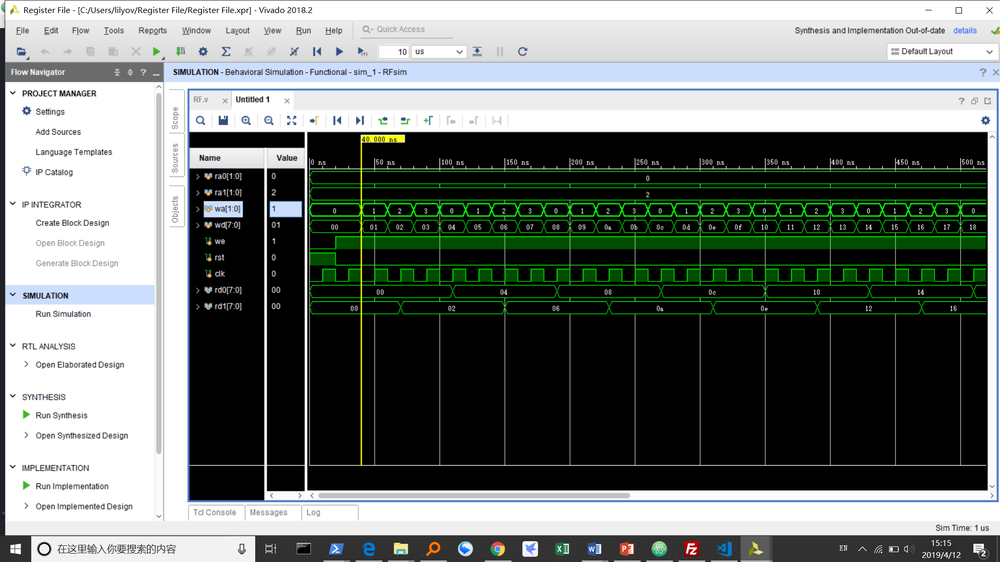

# 实验目的

- 重新巩固Verilog语法  
- 学习寄存器堆的概念
- 学习如何用Verilog实现模块中的寄存器堆，并实现一个寄存器堆模块。
- 利用寄存器堆实现一个循环队列。  


# 实验内容  
1.	寄存器堆（Register File）
- ra0, rd0; ra1, rd1：2个异步读端口
- wa, wd, we：1个同步写端口


2.	最大长度为8的FIFO循环队列：用寄存器堆和适当逻辑实现
- en_out, en_in：出/入队列使能，一次有效仅允许操作一项数据
- out, in：出/入队列数据
- full, empty：队列空/满，空/满时忽略出/入队操作
- display：8个数码管的控制信号，显示队列状态


# 逻辑设计  
- 模块化设计，RF 寄存器堆一个模块，QUEUE 为一个循环队列模块。  
- RF 采用模块化设计，在 top 里模块化调用时确定寄存器位数 WORD 和个数（实际为地址位数） ARRAY，为 8，2.
- QUEUE 逻辑:
  - base，top 出队、入队位置。
  - enin，enout 记录 en_in en_out 是不是持续的。拨动开关的时候，en_in 持续多个周期，但只入队一个数，靠 enin 实现，当 en_in 和 enin 都为1时不入队。
  - flag 8位，记录队列每一个位置也没有数据。
  - display 分为 dot,an[0:7],seg[0:6]

循环队列的实现逻辑类似数据结构课的内容，每一次出入队在一个周期里完成。

只有一个全局时钟，clk100M 的板载时钟经过 IP 核和模块分频之后降为1k，同时控制扫描显示和队列操作。

# 仿真/下载结果及分析
## RF

不断的写寄存器堆，wa 和 wd 每个周期加1，ra0 ra1 保持为0,2.可见 rd0 rd1 结果正确。
下载正确。

## QUEUE


这个仿真不断入队1、2、。。。，可见队列部分 regfile,top,base,enin,enout 等，扫描显示部分 seg,an,dot 部分都完全正确。


FEE1. bAd 队列的下载显示 feel bad:(

# 实验总结
实验结果符合预期，锻炼了自己的代码水平。

# 附录源码

<center>RF.v</center>

```Verilog
module top(
    input [1:0] ra0,
    input [1:0] ra1,
    input [1:0] wa,
    input [7:0] wd,
    input we,
    input rst,
    input clk,
    output [7:0] rd0,
    output [7:0] rd1
    );
   RF #(8,2) regfile (ra0,ra1,wa,wd,we,rst,clk,rd0,rd1);
endmodule

module RF #(parameter WORD=8,ARRAY=4)(
    input [ARRAY-1:0] ra0,
    input [ARRAY-1:0] ra1,
    input [ARRAY-1:0] wa,
    input [WORD-1:0] wd,
    input we,
    input rst,
    input clk,
    output [WORD-1:0] rd0,
    output [WORD-1:0] rd1
    );
    reg [WORD-1:0] regfile [0:2**ARRAY-1];
    assign rd0 = regfile [ra0];
    assign rd1 = regfile [ra1];
    integer k;
    always @ (posedge clk, posedge rst)
    begin
    if (rst)
    for (k=0;k<2**ARRAY;k=k+1)
        regfile[k]=0;

    else
        if (we)
            regfile[wa] = wd;
    end
endmodule
```

<center>RFsim.v</center>

```Verilog
module RFsim(
    );
    reg [1:0] ra0;
    reg [1:0] ra1;
    reg [1:0] wa;
    reg [7:0] wd;
    reg we;
    reg rst;
    reg clk;
    wire [7:0] rd0;
    wire [7:0] rd1;
    top DUT(ra0,ra1,wa,wd,we,rst,clk,rd0,rd1);
    initial
    begin
    rst=1;clk=0;
    ra0=0;ra1=2;
    we=0;wa=0;wd=0;
    #10 clk=1;
    #10 rst=0;clk=0;we=1;
    forever
    begin
    #10 clk=1;
    #10 clk=0;wa=wa+1;wd=wd+1;
    end
    end
endmodule

```
<center>QUEUE.v</center>

```Verilog
module QUEUE(
    input en_out,
    input [3:0] in,
    input en_in,
    input rst,
    //input clk,
    input clk100M,
    //input clk_1k,
    output reg [7:0] an,
    output reg [6:0] seg,
    output reg dot,
    output reg [3:0] out,
    output reg empty,
    output reg full,
    output locked
    );
    reg [2:0] base,top;
    reg enin,enout;
    reg [3:0] regfile [0:7];
    integer k;
    wire clk_1k;
    wire [6:0] seg0,seg1,seg2,seg3,seg4,seg5,seg6,seg7;
    reg [7:0] flag;

    lab8_1_1(clk100M,rst,1,clk_1k,locked);
    BCD7 bit0(regfile[0],flag[0],seg0);
    BCD7 bit1(regfile[1],flag[1],seg1);
    BCD7 bit2(regfile[2],flag[2],seg2);
    BCD7 bit3(regfile[3],flag[3],seg3);
    BCD7 bit4(regfile[4],flag[4],seg4);
    BCD7 bit5(regfile[5],flag[5],seg5);
    BCD7 bit6(regfile[6],flag[6],seg6);
    BCD7 bit7(regfile[7],flag[7],seg7);

    always@(posedge clk_1k)
        begin
        case(an)
        8'b11111110:begin an<=8'b11111101;seg<=seg1;dot<=base==1?0:1;end
        8'b11111101:begin an<=8'b11111011;seg<=seg2;dot<=base==2?0:1;end
        8'b11111011:begin an<=8'b11110111;seg<=seg3;dot<=base==3?0:1;end
        8'b11110111:begin an<=8'b11101111;seg<=seg4;dot<=base==4?0:1;end
        8'b11101111:begin an<=8'b11011111;seg<=seg5;dot<=base==5?0:1;end
        8'b11011111:begin an<=8'b10111111;seg<=seg6;dot<=base==6?0:1;end
        8'b10111111:begin an<=8'b01111111;seg<=seg7;dot<=base==7?0:1;end
        8'b01111111:begin an<=8'b11111110;seg<=seg0;dot<=base==0?0:1;end
        default:an<=8'b01111111;
        endcase
        end

    always @ (posedge clk_1k,posedge rst)
    begin
    if(rst)
        begin
        empty=1;full=0;
        enin=0;enout=0;
        base=3'b000;top=3'b000;
        for (k=0;k<8;k=k+1)
        begin
            regfile[k]=4'b0000;
        end
        flag=8'b11111111;
        //{dots0,dots1,dots2,dots3,dots4,dots5,dots6,dots7}=8'b11111111;
        end
    else
    begin
        if(en_in & !enin)
        begin
        enin=1;
        if(!en_out & !full)
        begin
            flag[top] = 0;
            regfile[top] = in;
            top = top+1;
            if(top==base) full=1;
            else empty=0;
        end
        end
        else
        if(!en_in) enin=0;

        if(en_out & !enout)
        begin
        enout=1;
        if(!en_in & !empty)
        begin
            flag[base] = 1;
            out = regfile[base];
            regfile[base] = 4'b0000;
            base = base+1;
            if(top==base) empty=1;
            else full=0;
        end
        end
        else
        if(!en_out) enout=0;
    end
    /*case(base)
    3'b000:dots0=0;
    3'b001:dots1=0;
    3'b010:dots2=0;
    3'b011:dots3=0;
    3'b100:dots4=0;
    3'b101:dots5=0;
    3'b110:dots6=0;
    3'b111:dots7=0;
    endcase*/
    end
endmodule

module BCD7 (
    input [3:0] x,
    input flag,
    output reg [6:0] seg
    );
    always @ *
    begin
    if(flag) seg=7'b1111111;
    else
    case(x)
    4'b0000:seg=7'b0000001;
    4'b0001:seg=7'b1001111;
    4'b0010:seg=7'b0010010;
    4'b0011:seg=7'b0000110;
    4'b0100:seg=7'b1001100;
    4'b0101:seg=7'b0100100;
    4'b0110:seg=7'b0100000;
    4'b0111:seg=7'b0001111;
    4'b1000:seg=7'b0000000;
    4'b1001:seg=7'b0000100;
    4'b1010:seg=7'b0001000;
    4'b1011:seg=7'b1100000;
    4'b1100:seg=7'b0110001;
    4'b1101:seg=7'b1000010;
    4'b1110:seg=7'b0110000;
    4'b1111:seg=7'b0111000;
    endcase
    end
endmodule
module lab8_1_1(
    input clk100M,
    input reset,
    input enable,
    output pulse,
    output locked
    );
    wire clk_out;
    clk_wiz_0 sss(clk_out,reset,locked,clk100M);
    reg [22:0] cnt;

    always@(posedge clk_out,negedge locked)
    begin
        if(~locked)
            cnt<=23'h0;
        else if(enable)
        begin
        if(cnt>=23'd6249)
            cnt<=23'h0;
        else cnt<=cnt+23'h1;
        end
    end
    assign pulse=(cnt==23'd3000)?1:0;
endmodule
```

<center>QUEUEsim.v</center>

```Verilog
module QUEUEsim(
    );
    reg en_out;
    reg [3:0] in;
    reg en_in;
    reg rst;
    reg clk_1k;
    reg clk100M;
    wire [7:0] an;
    wire [6:0] seg;
    wire dot;
    wire [3:0] out;
    wire empty;
    wire full;
    wire locked;

    integer k;
    QUEUE DUT(en_out,in,en_in,rst,clk_1k,an,seg,dot,out,empty,full,locked);
    initial
    begin
    rst=1;clk_1k=0;
    en_out=0;en_in=0;in=4'b0000;
    #10 clk_1k=1;
    #10 clk_1k=0;rst=0;en_in=1;
    forever
    begin
    #10 clk_1k=1;
    #10 clk_1k=0;
    #10 clk_1k=1;
    #10 clk_1k=0;
    en_in=0;
    for(k=0;k<28;k=k+1)
    #10 clk_1k=~clk_1k;
    en_in=1;
    in=in+1;
    end
    end
endmodule
```
